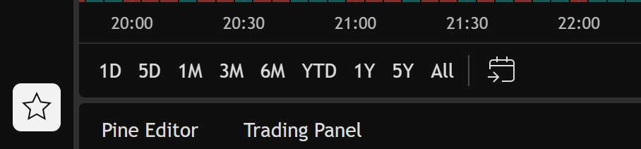
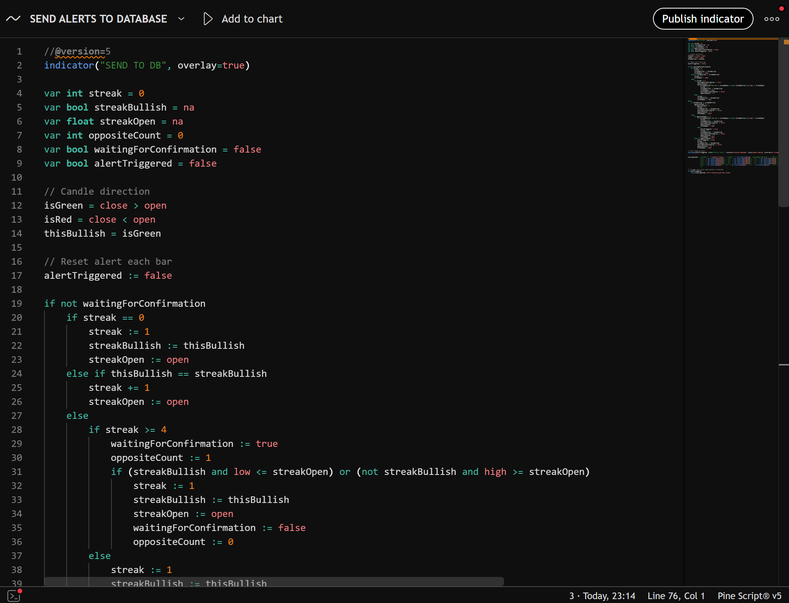
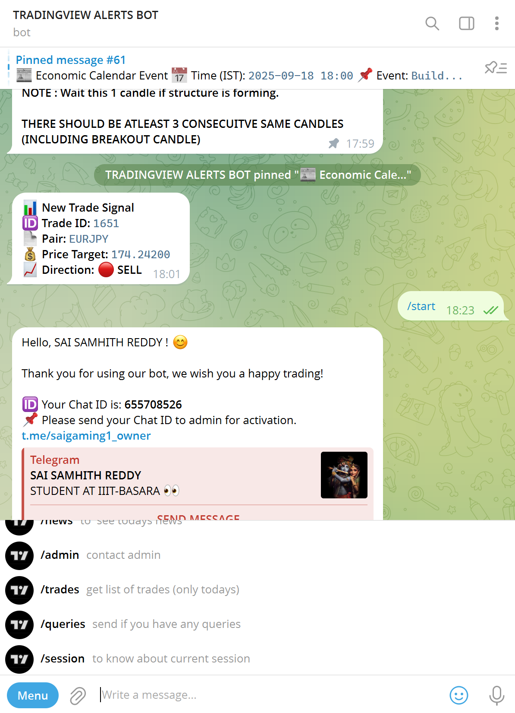
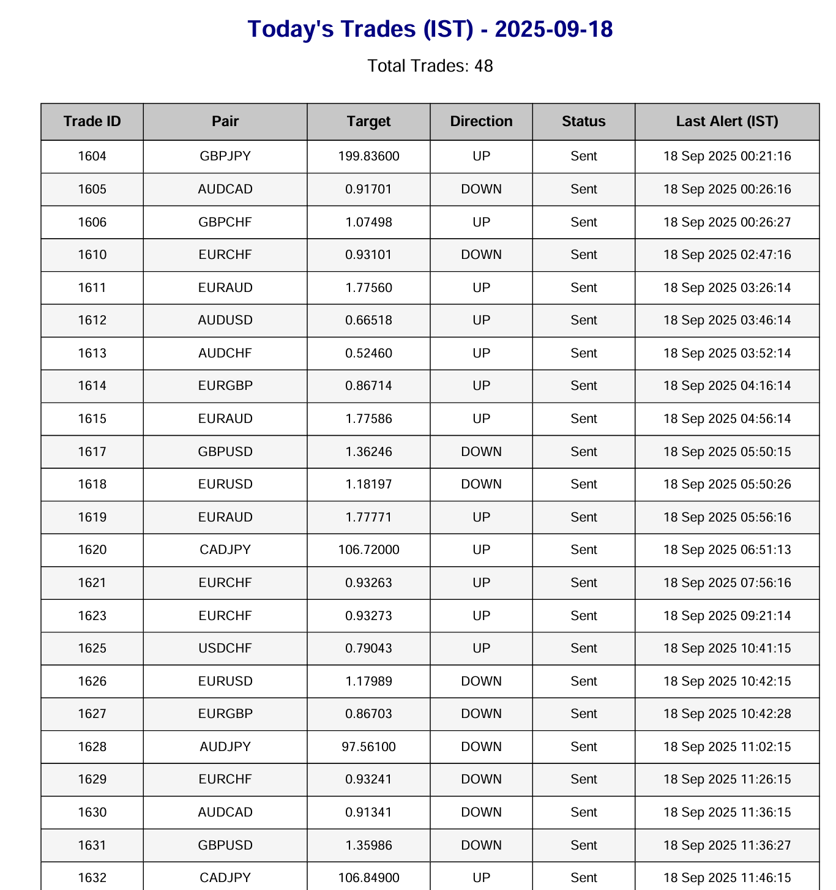
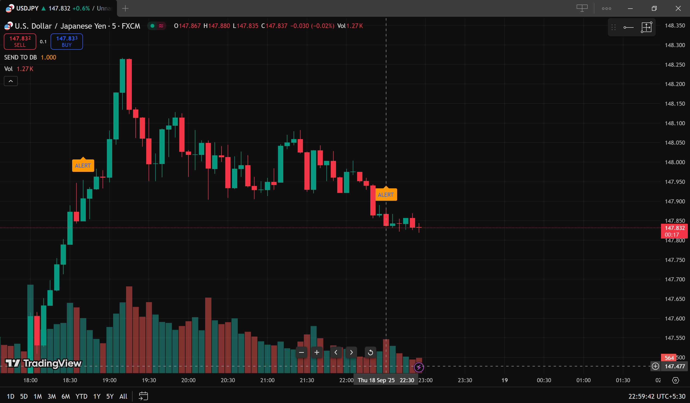
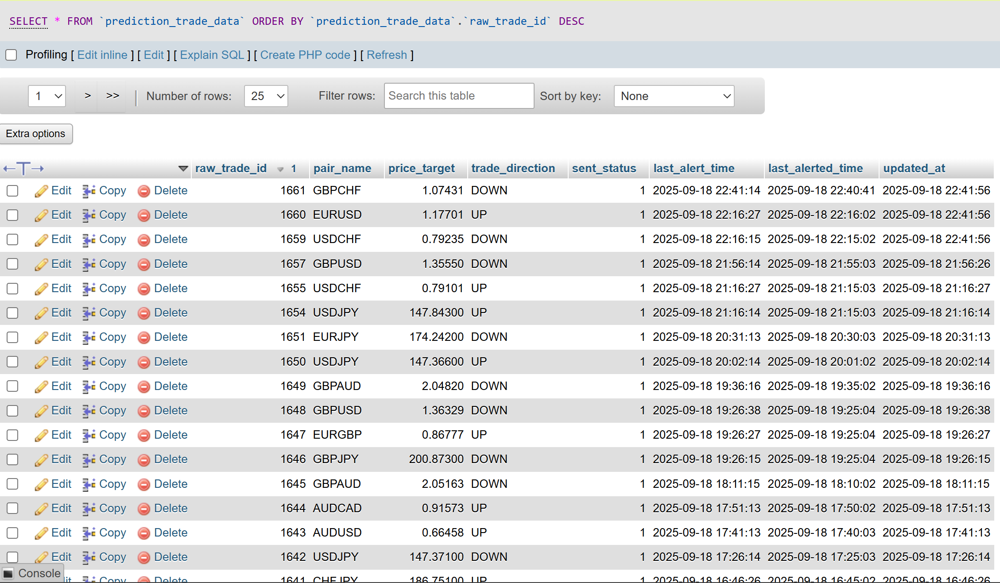
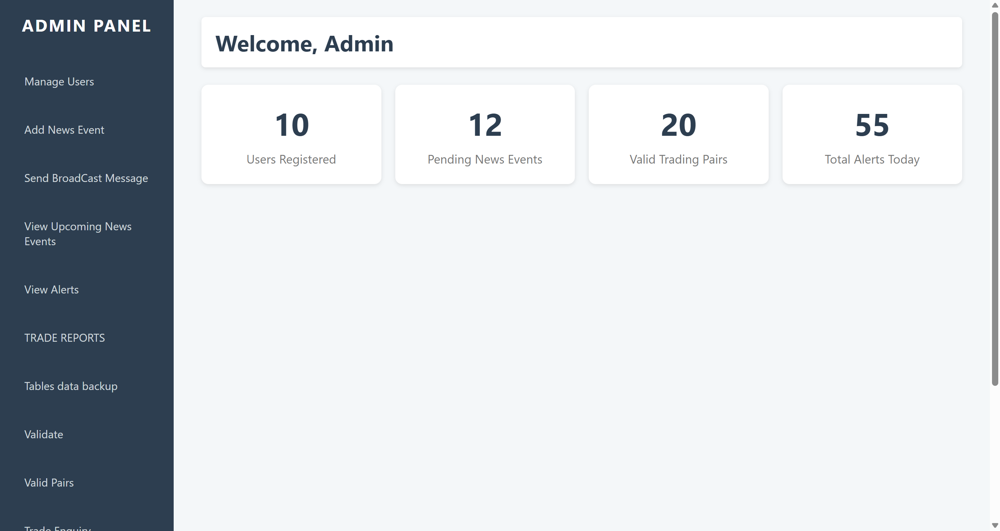
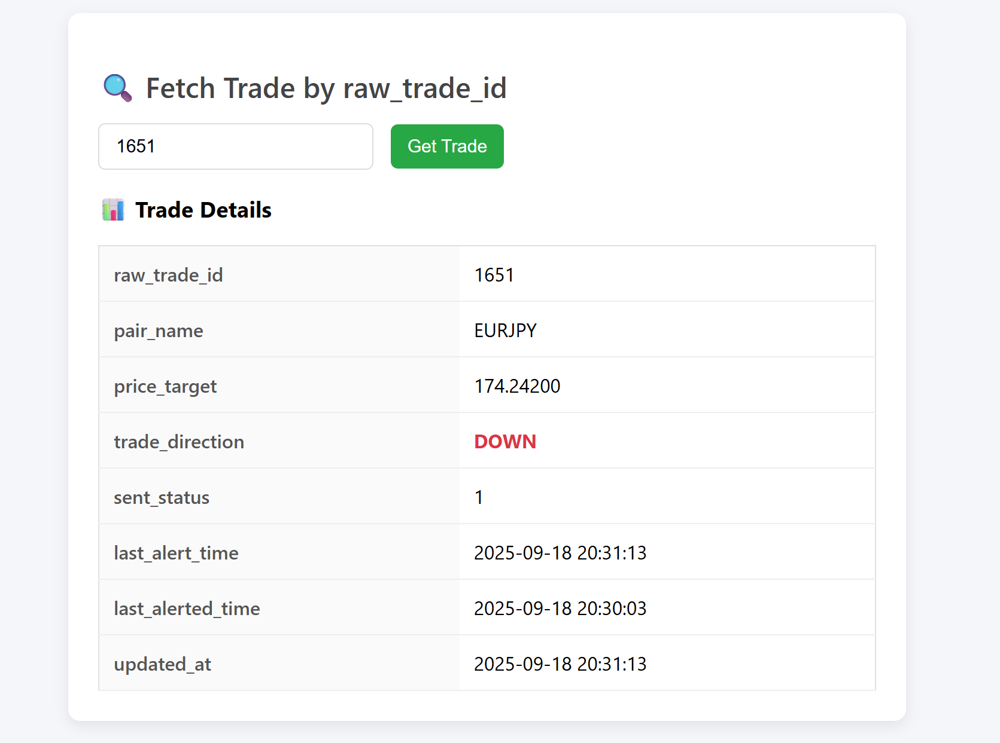
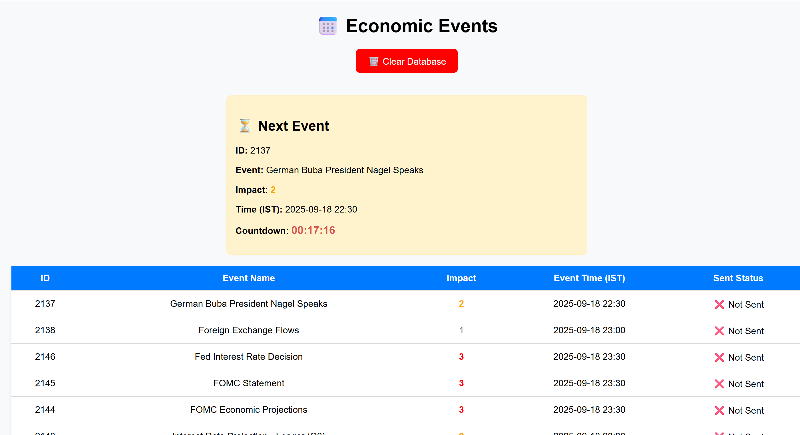

# Trading Bot

This repository is created for binary trading in 5 minutes time frame, this has many advanced features with web panels.

This requires "TRADINGVIEW API" so which we can get trail for 30 days. 

Run the specific pinescipt when an alert triggers it send POST request as JSON.

## Features
- Sends alerts directly to your telegram account. 
- Admin panel with advanced features like :
  	- Add News data
  	- Send Broadcast mesaages to users 
	- Trade reports (PDF)
   	- Tables backup
   	- Trade Enquiry
   	- Live prices
	- Telegram alerts
	- User management
 	- Webhook to telegram using API
    - GENERATE TOKENS
    - SESSION INFO 
- when an unauthorised user uses the bot it will be logged and sent to admin.
- from bot itself we can fetch many features such as trade list, session info.

## How it works

1. First use the code in pinescript.txt copy the code (as it is beacuse its like python need indentation) and add to chart in tradingview.
	
	we can find PINE EDITOR in left bottom of tradingview.

	it looks like this: 

Now save the script and click "ADD TO CHART"

	

it looks like this: 

2. Set up database connection (`db.php`)
   	- add server deatils and bot token and admin chat id 

3. Run `setup.php` to Setup tables and admin login.
   	- this will create all required tables which are required for functioning.

4. use TRADINGVIEW webhookURL and set "yourwebsite.site/receiver.php" 

setup webhook : 

5. Alerts are sent via `tg.php` or `webhook.php`

6. Admin dashboard available via `admin_dashboard.php`

## Screenshots
IMAGE-1 

IMAGE- BOT COMMAND LIST 

TRADES LIST PDF  

LIVE CHART IMAGE 

BACKEND SQL OVERVIEW 

ADMIN DASHBOARD 

TRADE FTECH PAGE 

NEWS EVENTS PAGE 

