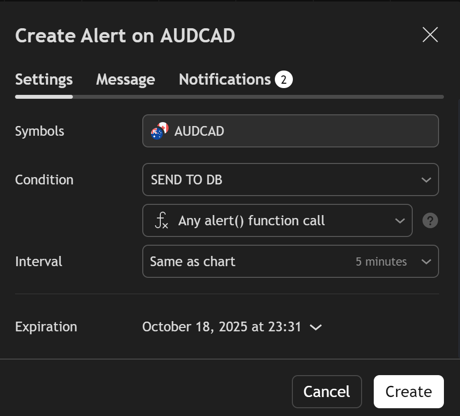
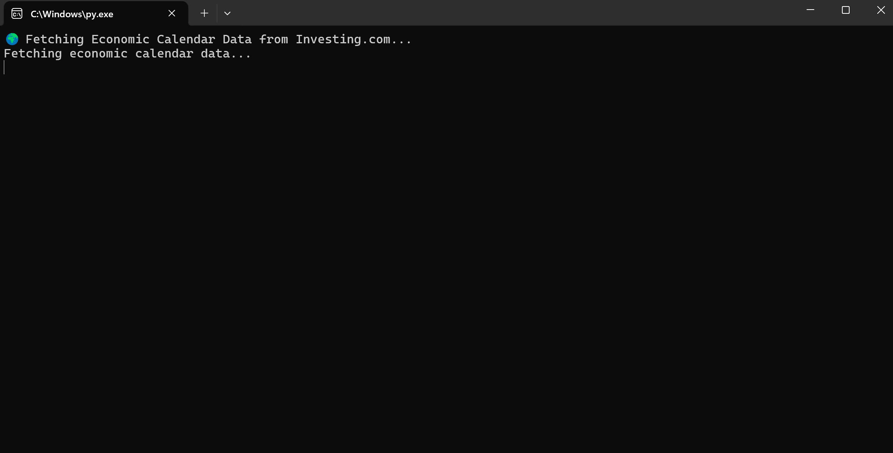
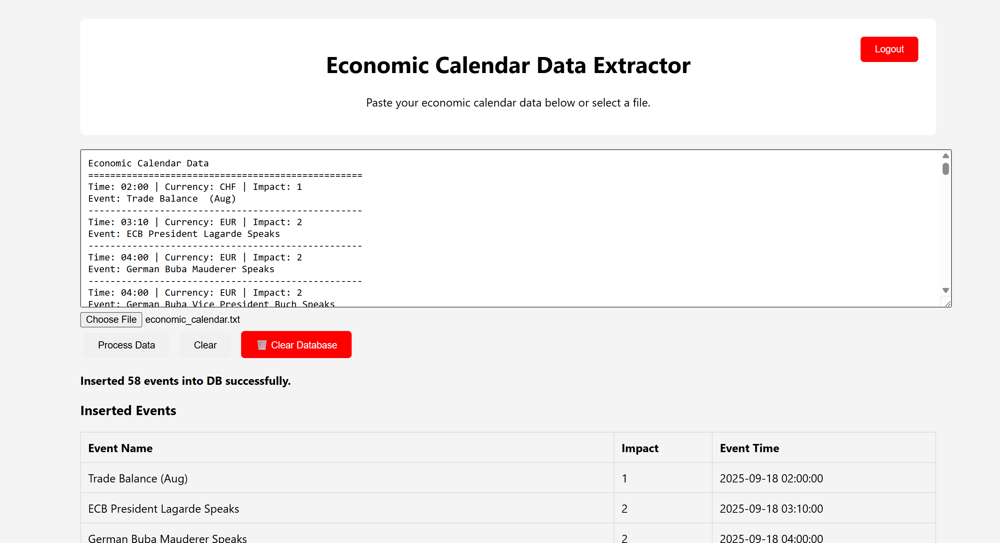

# Trading Bot

This repository is created for binary trading bot in 5 minutes time frame, this has many advanced features with web panels.

This requires "TRADINGVIEW PLAN" so which we can get trail for 30 days. 

Run the pinescipt Provided when an alert triggers it send POST request as JSON.

I'm working on improving this bot, open to collaborations. 
Currently it works in FOREX currency pairs. looking forward to expand to Crypto and Stock markets.

## Features
- Sends alerts directly to your telegram account . 
- Admin panel with advanced features like :
  	- Add News data
  	- Send Broadcast mesaages to users 
	- Trade reports (PDF)
   	- Tables backup
   	- Trade Enquiry
   	- Live prices
	- Telegram alerts
	- User management
 	- Webhook to telegram using API
    - GENERATE TOKENS
    - SESSION INFO 
- when an unauthorised user uses the bot it will be logged and sent to admin.
- from bot itself we can fetch many features such as trade list, session info.

## How it works

Step - 0. First create a bot form https://t.me/BotFather and get token of bot and then update commands there. 

setup webhook to bot: api.telegram.org/bot"BOT_TOKEN LIKE 1234:ABCDEFGH"/setWebhook?url= "YOUR WEBSITE/webhook.php"
remove " when using . 

Step - 1. First use the code in pinescript.txt copy the code (as it is beacuse its like python need indentation) and add to chart in tradingview.  
	
we can find PINE EDITOR in left bottom of tradingview.  

it looks like this:   

Now save the script and click "ADD TO CHART"  
  

	
Step - 2. NOW in right side we have alerts (alaram symbol) click on that  
it looks like this:   

Now click on plus (" + ") ICON a pop up will display .   

select the assets or directly create a watchlist so we can add this to it.   

CONDITION : SEND TO DB (or name what you gave to it..)  

SELECT : any alert() function call.  

INTERVAL : 5 minutes   

  
 

Click on CREATE  .     

Step - 3. Set up database connection (`db.php`)
   	- add server deatils and bot token and admin chat id 

Step - 4. Run `setup.php` to Setup tables and admin login.
   	- this will create all required tables which are required for functioning.

Step - 5. Go Back to TRADINGVIEW alerts and in notifications setup using next step.

Step - 6. use TRADINGVIEW webhookURL and set "yourwebsite.site/receiver.php" 

setup webhook : 

Step - 7. Admin dashboard available via `admin_dashboard.php`

Step - 8. Alerts are sent via `tg.php` or `webhook.php`

Step -9. Exexute the python file `news.py`  
it will create a file 'economic_calendar.txt' this will scrape from investing.com website.

   

Step -10.  Now to add news select the genrated file and click on process data, it will add to database. 

## Screenshots
IMAGE-1 

IMAGE- BOT COMMAND LIST 

TRADES LIST PDF  

LIVE CHART IMAGE 

BACKEND SQL OVERVIEW 

ADMIN DASHBOARD 

TRADE FTECH PAGE 

NEWS EVENTS PAGE 

