# TradingView Alerts Bot


<p align="center">
  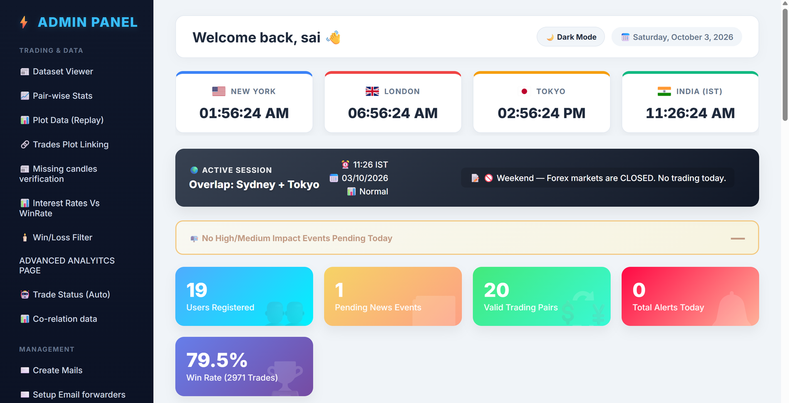
</p>

A self-hosted forex signal platform built on PHP + MySQL. It takes 5-candle pattern alerts from TradingView, works out a price target, sends the signal with a chart image to subscribers on Telegram, and later grades each trade as a win, loss or "setup not formed" against real 5-minute candle data. An admin panel covers operations, analytics and research.

> **Author:** [Sai Samhith Reddy](https://github.com/iamsaisamhithreddy) · [LinkedIn](https://www.linkedin.com/in/saisamhithreddy)

---

## Screenshots

### Telegram bot

| New trade signal | Economic events | `/status` |
|---|---|---|
| 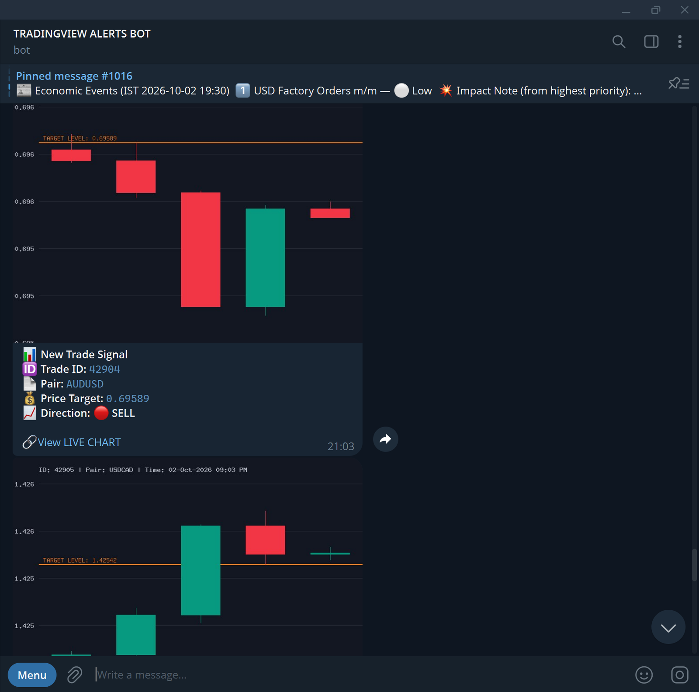 | 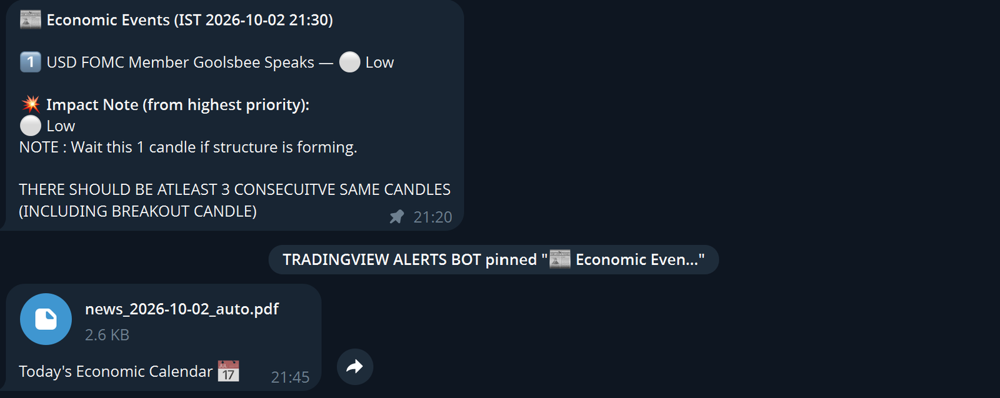 | 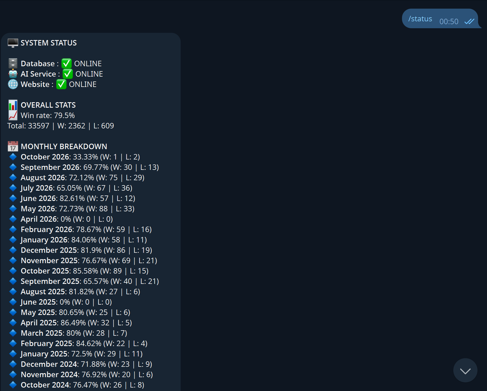 |

### Admin panel

| Dashboard health | Maintenance, ESP32 & bot health |
|---|---|
| 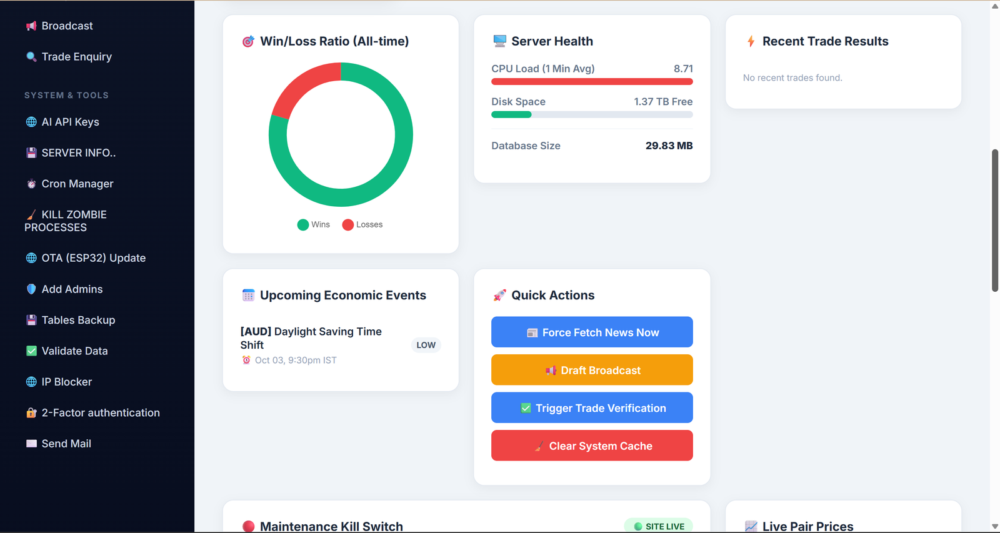 | 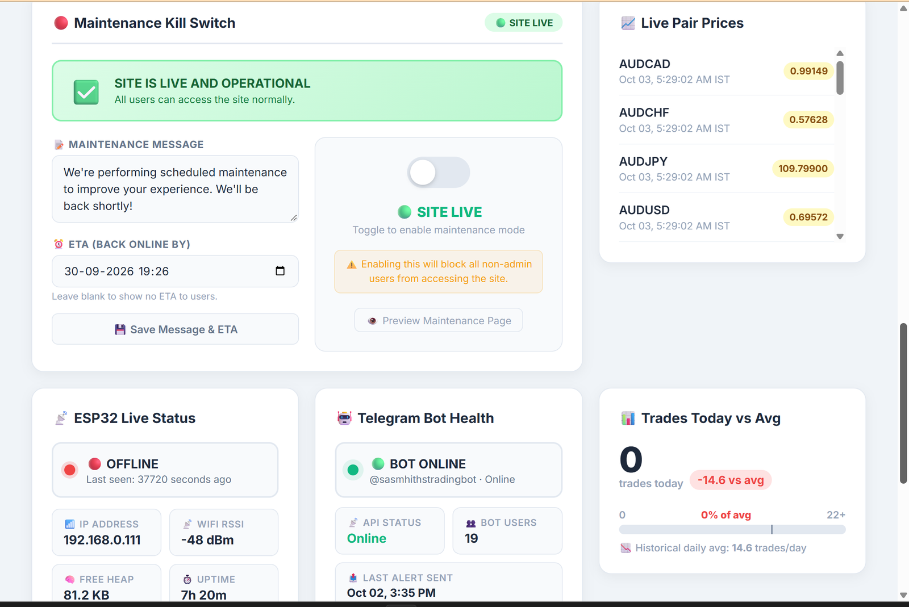 |
| **Broadcast** | **Manage Telegram users** |
| 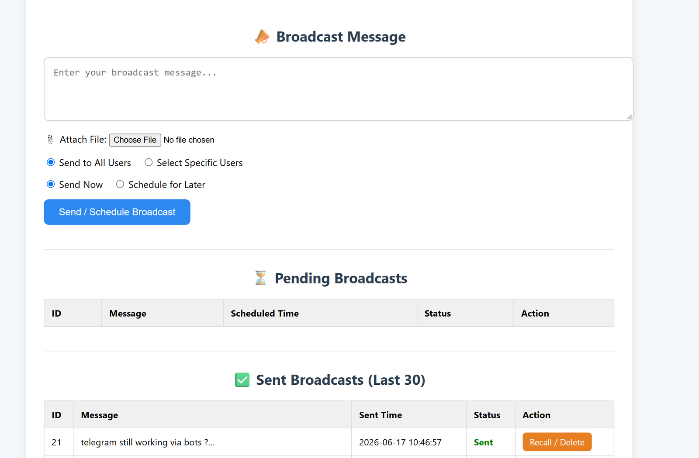 | 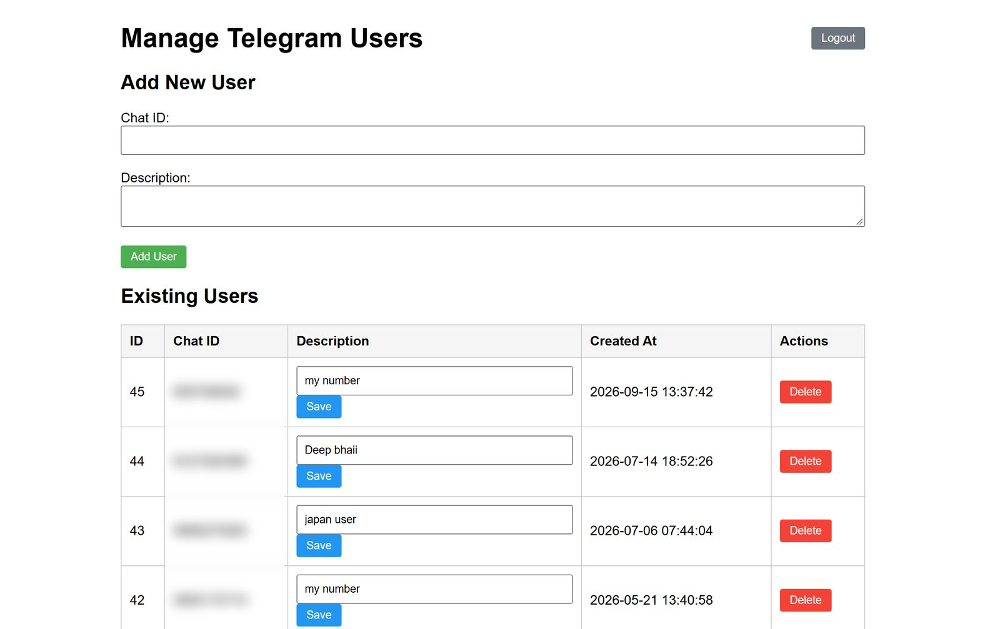 |
| **Admin permissions** | **AI API key manager** |
| 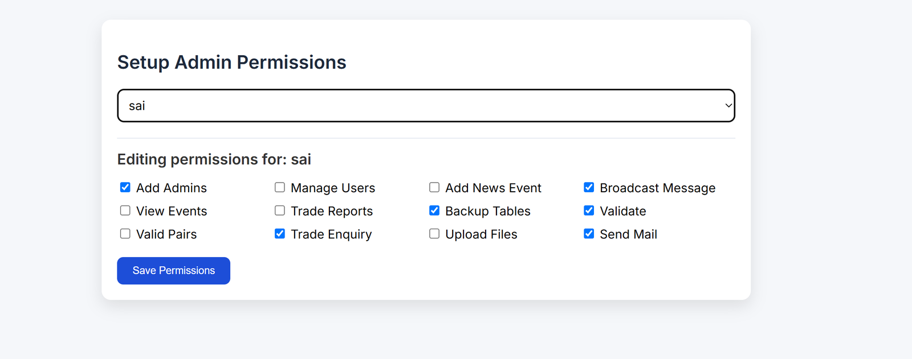 | 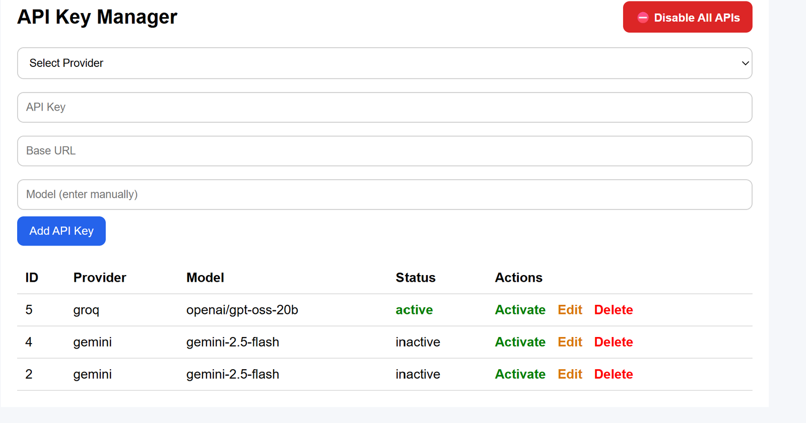 |
| **Today's economic events** | **ESP32 OTA firmware update** |
| 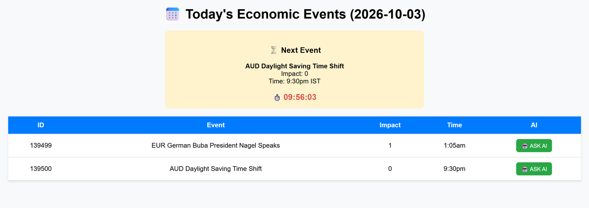 | 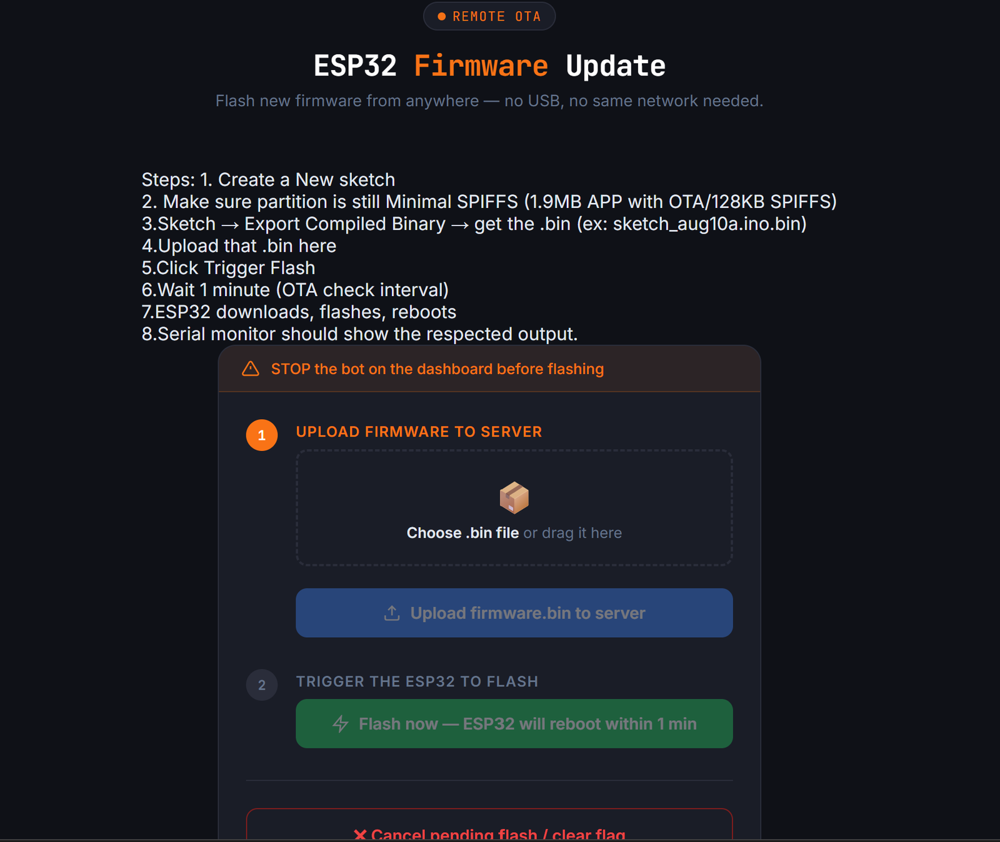 |

### Trades & analytics

| Trade plotter | Trade enquiry |
|---|---|
| 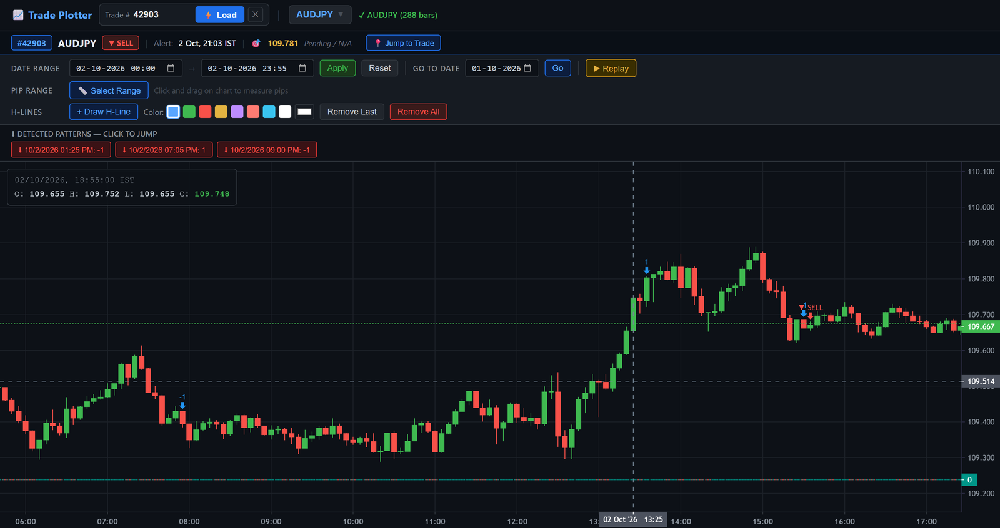 | 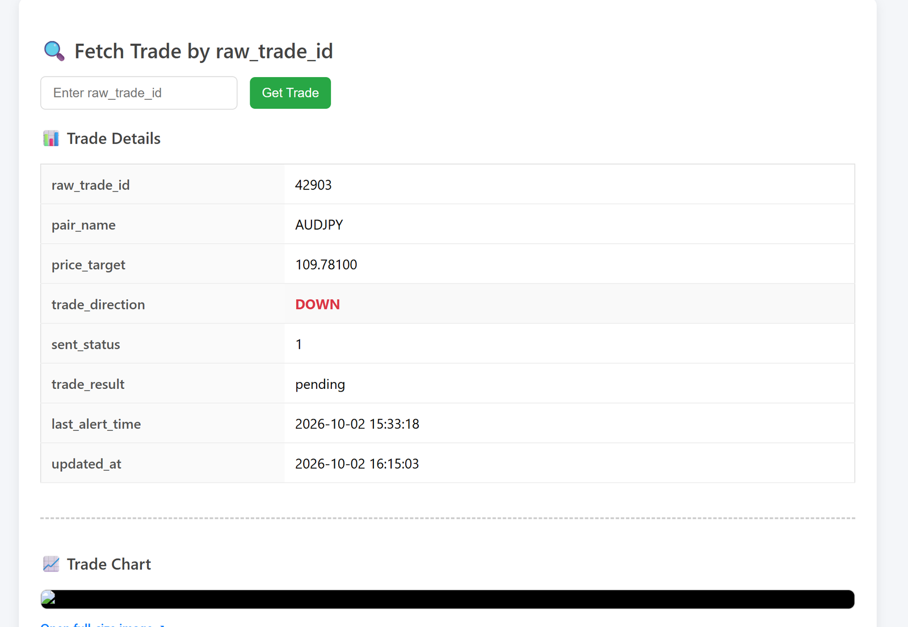 |
| **Generate report** | **Trade analytics report (PDF)** |
| 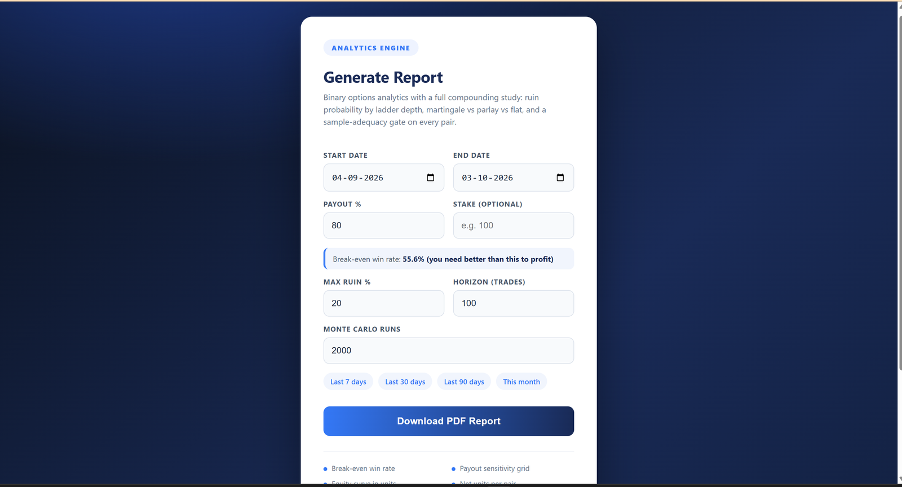 | 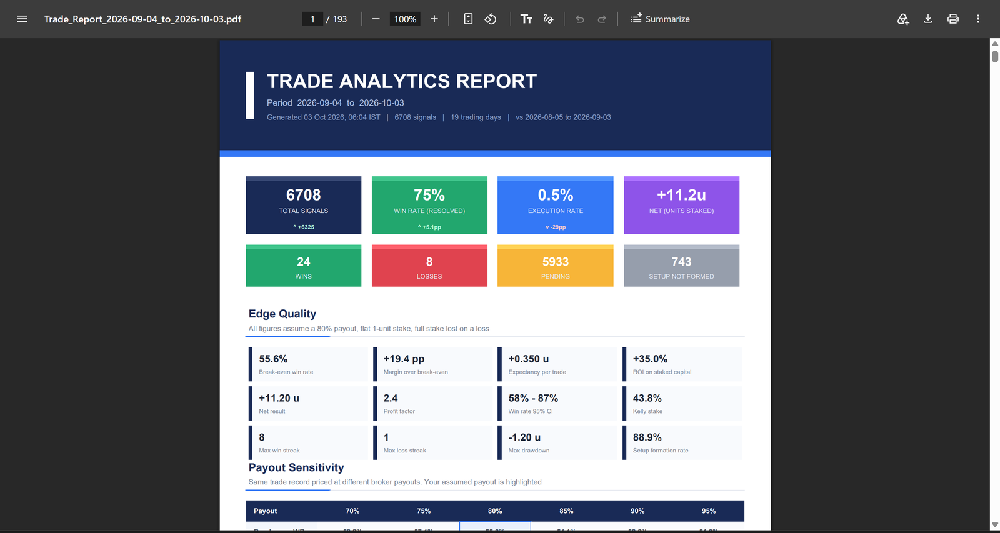 |
| **Research dashboard** | |
| 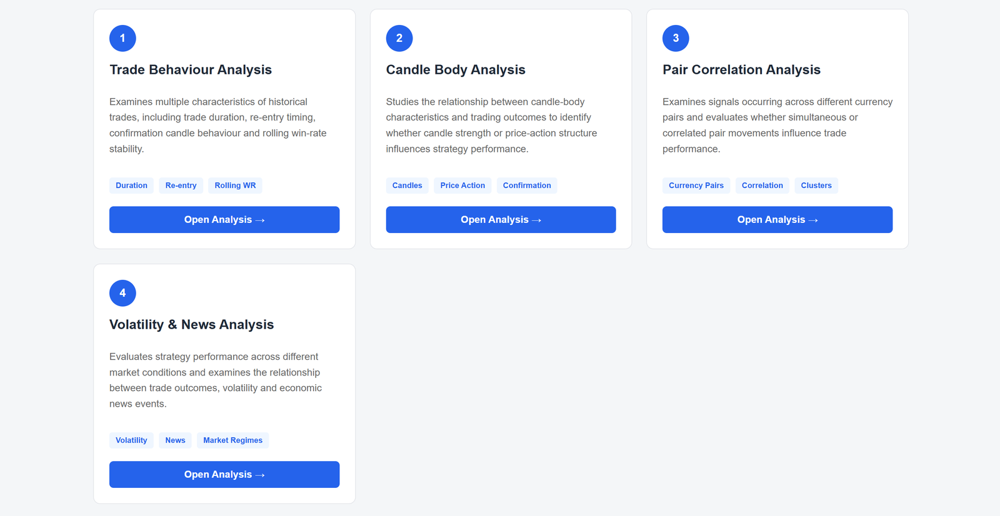 | |

---

## Features

**Signals & alerts**
- TradingView webhook receiver: `receiver.php` stores the ticker plus the last 5 OHLC candles.
- Pattern + price-target engine in `lib_candle_algo.php` (shared by the live and historical evaluators).
- Telegram alerts to every registered user. Each alert has the pair, trade ID, target, direction, a chart image and a **View LIVE CHART** link.
- A price-zone tracker (`price_track_send_alerts.php`) pings users when live price reaches a target. It holds back while news is near and deletes old alerts automatically.
- Economic calendar: pulled from the ForexFactory weekly feed (`fetch_news.php`), with manual entry too. Events are pinned in Telegram with an impact note, and a daily calendar PDF is sent.

**Telegram bot (`webhook.php`)**

| Command | What it does |
|---|---|
| `/start` | Welcome message |
| `/status` | System health + overall and monthly win rate |
| `/trades` | Today's trades (sent as a PDF) |
| `/all [n]` | Recent trades list |
| `/trade_enquiry <id>` | Look up one trade |
| `/analyze <PAIR> [DAY]` | Pair / day-of-week stats |
| `/news` | Today's economic events |
| `/session` | Active forex session + confidence note |
| `/swing` | Swing view |
| `/ai <question>` | Ask the configured LLM (Groq / Gemini / OpenAI / xAI) |
| `/ss <url>` | Website screenshot |
| `/login`, `/dashboard` | Admin login link / Telegram mini app |
| `/faq`, `/admin` | Help & contact |
| 🎤 Voice note | Speech → text → AI → voice reply (Wit.ai + ffmpeg) |

Only chat IDs in `telegram_users` can use the bot. Attempts from anyone else are logged to `unauthorized_attempts`.

**Admin panel (`admin_dashboard.php`)**
- World clocks, active session, pending news, users, valid pairs, alerts today, all-time win rate
- Server health (CPU load, disk, DB size), maintenance kill switch, live pair prices
- ESP32 live status (heartbeat, RSSI, heap, uptime), Telegram bot health, trades today vs average
- Broadcasts (send now or schedule, with attachments, recall/delete)
- Manage Telegram users, admins and per-admin permissions, 2FA (TOTP), IP blocker
- AI API key manager (switch the active provider/model)
- Cron manager, zombie-process killer, table backups, full hosting backup, data validation
- cPanel helpers: create mailboxes, forwarders, autoresponders, send mail
- OTA firmware updates for the ESP32 data collector

**Analytics & research**
- `Trade_report.php`: PDF report covering break-even win rate, payout sensitivity, expectancy, profit factor, Wilson 95% CI, Kelly stake, drawdown, a martingale / parlay / flat compounding study with ruin probability (Monte Carlo), and a per-pair sample-adequacy gate
- `analysis/`: trade behaviour (duration, re-entry, rolling WR), candle body vs win rate, pair correlation clusters, volatility & news regimes
- `impact.php`, `news_correlation.php`, `candles_news.php`: news impact on pairs (after Balduzzi, Elton & Green 2001)
- `intrestRates_WinRate_relation.php`, `co-relation.php`, `currency_strength.php`, `htf.php`, `stats.php`
- `dataset/research_paper_*.php`: liquidity and news-shock research reports

**Charting**
- `livechart/`: multi-chart live terminal (TradingView Lightweight Charts)
- `plot/`: Trade Plotter. Load a trade by ID, jump to it, replay candles, measure pips, draw H-lines and view detected patterns. Also renders the chart images used in alerts
- `plot/simulator.php`: 5-candle strategy simulator

---

## How a signal works

```
TradingView alert ──► receiver.php ──► raw_trade_data (pair + 5 OHLC candles)
                                           │
                     valid_pairs.php ◄─────┘   pattern check + price target
                           │
                           ▼
                prediction_trade_data (target, UP/DOWN)
                           │
          ┌────────────────┼──────────────────────────┐
          ▼                ▼                          ▼
   Telegram signal   price_track_send_alerts   evaluate_win_loss.php
   + chart image     (price in target zone)    (grades vs 5-min CSV candles)
```

**Pattern (candles oldest → newest, 5 in total)**
1. The first 3 candles must all be the same colour. This sets the trend.
2. Candles 4–5 are the opposite-colour pullback. The **price target** comes from the pullback high/low, or from candle 3's / candle 2's extreme when the pullback reaches candle 3's midpoint (an upper/lower-wick rule applies).

**Grading (`evaluatePatternTrade`)**
- Price has to close through the target after a wave of at least 3 candles. If it gets there faster, the result is `setup_not_formed` (a high-impact news candle is the exception).
- After the break there must be **at least 3 consecutive same-colour candles**, breakout candle included.
- The next candle closing in the trade direction is a **Direct Win**. If it doesn't, the candle after it is checked (**MTG1 Win**). If neither does, it's a **Loss**.
- News cooldown: impact 1 skips 1 candle, impact 2 skips 5 and impact 3 skips 8, so streaks are not counted across news.
- Trades that are still unresolved at 21:30 IST are closed as `setup_not_formed`.

---

## Data pipeline

- An **ESP32/ESP8266** fetches 5-minute OHLC candles and posts them to `dataset/add.php`. It sends a heartbeat to `check_esp.php` and is switched on and off through `control.php`. Firmware is flashed remotely from `ota/` (upload `.bin`, then trigger; the device polls every minute).
- `update_price.php` keeps `live_price_data` and the current candle row in each pair's CSV up to date.
- CSV layout:
  ```
  dataset/dataset/<PAIR>/FX_<PAIR>-YYYY-MM-DD.csv      # live / current
  dataset/JUN-2025 TO FEB-2026/<PAIR>/...              # archive
  dataset/BEFORE-JUN-2025/<PAIR>/...                   # archive
  dataset/1min/                                        # 1-minute data
  ```
- `missing_candles_data.php` finds gaps. `recover_historical.php` and `evaluate_historical.php` backfill and re-grade older trades.

Pairs: AUDCAD, AUDCHF, AUDJPY, AUDUSD, CADJPY, CHFJPY, EURAUD, EURCAD, EURCHF, EURGBP, EURJPY, EURUSD, GBPAUD, GBPCAD, GBPCHF, GBPJPY, GBPUSD, USDCAD, USDCHF, USDJPY.

---

## Tech stack

- **Backend:** PHP 7.4+ (mysqli, cURL), MySQL / MariaDB
- **Frontend:** HTML/CSS/JS, [TradingView Lightweight Charts](https://github.com/tradingview/lightweight-charts) (vendored in `lightweight-charts-master/`), Tailwind CDN on some pages
- **PDF:** [FPDF](http://www.fpdf.org/)
- **Integrations:** Telegram Bot API, Wit.ai (speech / TTS), Groq / Gemini / OpenAI / xAI, ForexFactory calendar, cPanel UAPI, urlbox
- **Hardware:** ESP32 / ESP8266
- **Hosting:** cPanel shared hosting + cron

---

## Setup

1. **Clone** into your web root (e.g. `public_html`).
   ```bash
   git clone https://github.com/iamsaisamhithreddy/tradingbot.git
   ```
2. **Config.** Copy `db.example.php` to `db.php` and fill in your DB credentials, `$WebsiteURL`, `$botToken`, `$adminChatId`, `$witAiToken` and the backup channel IDs. The cPanel features (backups, IP blocker, mail tools) also need `$cpanel_user`, `$cpanel_token` and `$email`.
3. **Database.** Create a MySQL database, then open `setup.php` once in the browser to create the tables and a default admin. **Change the default password straight away and delete `setup.php` from the server.**
4. **Telegram webhook.**
   ```
   https://api.telegram.org/bot<TOKEN>/setWebhook?url=https://yourdomain.com/webhook.php
   ```
   Then add the users' chat IDs in **Manage Telegram Users**.
5. **TradingView alert.** Point the webhook URL at `https://yourdomain.com/receiver.php` with a JSON body like:
   ```json
   { "ticker": "EURUSD",
     "ohlc": [ {"O":1.1,"H":1.2,"L":1.0,"C":1.15}, … 5 candles, oldest first … ] }
   ```
6. **Cron jobs.** Schedule these with the Cron Manager page or cPanel, using `/usr/bin/php -q <file>`:

   | Script | Purpose |
   |---|---|
   | `valid_pairs.php` | Validate patterns & compute targets |
   | `tg.php` | Send signals / news to Telegram |
   | `price_track_send_alerts.php` | Price-zone alerts |
   | `evaluate_win_loss.php` | Grade trades |
   | `fetch_news.php` | Pull the economic calendar |
   | `broadcast.php` | Send scheduled broadcasts |
   | `process_delete_queue.php` / `delete_messages.php` | Auto-delete old alert messages |
   | `daily_trades_pdf.php`, `daily_news_pdf.php` | Daily PDFs |
   | `telegram_dataset_backup.php`, `backup.php` | Backups |

7. **Voice features** need an `ffmpeg` binary in the project root, made executable. It is git-ignored, so download a static build.

---

## Project structure

```
├── webhook.php                 # Telegram bot
├── receiver.php                # TradingView webhook
├── lib_candle_algo.php         # pattern / target / grading logic
├── valid_pairs.php             # signal validation
├── evaluate_win_loss.php       # trade grading
├── price_track_send_alerts.php # price-zone alerts
├── admin_dashboard.php         # admin home
├── Trade_report.php            # analytics PDF
├── analysis/                   # research dashboards
├── livechart/                  # live multi-chart terminal
├── plot/                       # trade plotter, simulator, chart images
├── dataset/                    # candle CSVs + data tools
├── ota/                        # ESP32 OTA firmware updates
├── Trades/                     # broker trade-history CSV analyzer
├── flags/                      # session flag icons
├── font/, makefont/            # FPDF fonts
└── db.example.php              # config template
```

---

## Security notes

- Keep `db.php`, `totp_store.json`, `setup.php` and log files out of public repos. Never hard-code tokens in scripts; read them from `db.php`.
- Admin pages require login and support TOTP 2FA and per-admin permissions.
- Delete one-off utilities (`setup.php`, `kill_zombies.php`, `phpinfo.php`, `diagnose_503.php`) from production after use.

---

## Disclaimer

This project is for educational and research use. Trading forex or binary options carries a high risk of loss. Past win rates do not guarantee future results, and nothing here is financial advice.

## License

Bundled third-party code keeps its own license: FPDF (`license.txt`) and Lightweight Charts (`lightweight-charts-master/LICENSE`, Apache-2.0).
