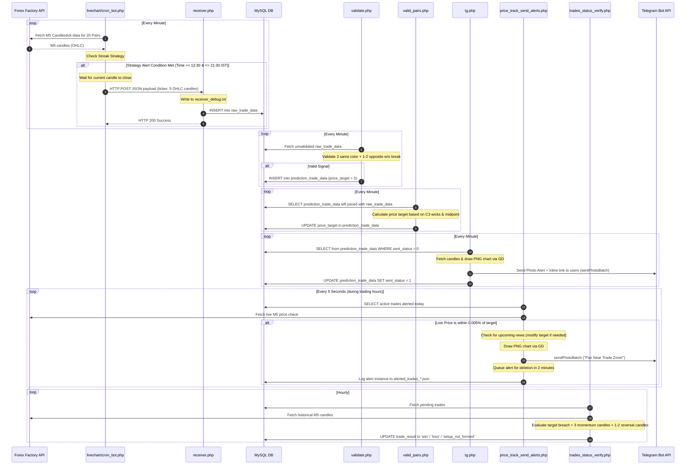

# Smart Trading Bot - In-Depth System Context & Technical Reference

This document provides a highly detailed, comprehensive context of the **Smart Trading Bot** codebase. It covers the system's architecture, database design, logic flows, trading strategy rules, and how individual components integrate to build a complete automated trade signaling, price tracking, news broadcasting, and outcome evaluation system.

---

## 📂 Core Project Files

All references in this document point to the live codebase files. Click any file below to view its contents directly:
- **Core Configuration & Setup**:
  - [db.php] — Database credentials, global parameters, NLP & Telegram tokens.
  - [setup.php] — Core database schema initialization and default admin registration.
  - [install.txt] — FPDF font setup details.
- **Telegram Bot Webhooks & Handlers**:
  - [webhook.php] — Main entrypoint for Telegram messages, commands, NLP callbacks, and inline queries.
  - [voice_webhook.php] — Alternative webhook for pure voice-to-voice communication.
- **Core Background Engines**:
  - [livechart/cron_bot.php] — Multi-pair real-time Forex Factory candlestick scraper and strategy scanner.
  - [receiver.php] — Webhook target that receives triggered signal alerts and saves raw candle groups.
  - [validate.php] — Pattern verification validator matching strict color and retracement constraints.
  - [valid_pairs.php] — Price target generator calculating exact mathematical breakout support/resistance lines.
  - [tg.php] — Telegram broadcaster distributing trade alerts with dynamic GD charts and economic calendar news templates.
  - [price_track_send_alerts.php] — Live price monitoring script sending alerts when close ticks approach signal target zones.
  - [livechart/trades_status_verify.php] — Automated real-time trade evaluator scoring wins, losses, or setup failures.
  - [verify.php] — Offline/Bulk trade evaluator scoring outcomes based on CSV files.
  - [delete_messages.php] — Background worker managing clean-up loops of transient Telegram alerts.
  - [delete_expired.php] — Cron-target clearing calendar news events occurring before today.
- **Frontend Visualization & Dashboards**:
  - [livechart/index.html] — Live Dual-View Terminal embedding Lightweight Charts alongside standard TradingView frames.
  - [livechart/fetch_live_data.php] — Endpoint supplying full history, delta ticks, or SSE streams of real-time Forex Factory candles to the UI.
  - [trail/plot.php] — Visualizer plotting trade entries and targets using historical CSV logs.
  - [trail/process_csv.php] — CSV file parser converting tabular ticks into Lightweight Charts input.
  - [stats.php] — Performance analytics dashboard showing win rates, session curves, and currency rankings.
  - [admin_dashboard.php] — Control panel hosting active session banners and navigation controls.
  - [forex.php] — Grid of TradingView 5-minute external chart links.
- **Artificial Intelligence & NLP**:
  - [ai_admin_analytics.php] — AI agent routing DuckDuckGo searches to Gemini, Groq, OpenAI, or xAI.
  - [trading_context.txt] — Custom knowledge file supplied to the AI system prompt.
- **Admin Configuration Utilities**:
  - [login.php] — Session login system using standard forms or Telegram logins.
  - [permissions.php] — User role configuration page for customizing admin privileges.
  - [api_keys_add.php] — Admin view managing active API keys, Base URLs, and model selection.
  - [master_dispatcher.php] — Cron task supervisor toggle board.
  - [Trade_report.php] — Interactive FPDF custom report compiler with clickable chart routing.
  - [daily_news_pdf.php] — FPDF-based daily news catalog broadcast tool.
  - [daily_trades_pdf.php] — FPDF-based daily trades result catalog broadcast tool.
  - [tables_backup.php] — Quick backup helper creating duplicates of predictions and raw candles.
  - [re_update.php] — Session-based bulk recalculator for database price targets.
  - [check.php] — Comparison script comparing live price targets with backup targets.

---

## 🏛️ System Architecture & Data Flow

The following sequence details how market tickers turn into Telegram alerts and are verified:



---

## 🗄️ Database Architecture

The system utilizes an InnoDB database (defined in [setup.php](file:///c:/Users/Lenovo/Desktop/B%20TECH%20PROJECTS/MAJOR%20PROJECT/SMART%20TRADING%20BOT%20SOURCE%20CODE/setup.php)) running in the `Asia/Kolkata` timezone. Below are the key tables and relations:

### 1. `admin_users`
Stores administrative user accounts, hashed passwords, and JSON permission arrays.
* **Fields**:
  - `id` (`INT(11)` AUTO_INCREMENT, PRIMARY KEY): Unique identifier.
  - `username` (`VARCHAR(50)`, UNIQUE): Login name.
  - `password_hash` (`VARCHAR(255)`): Hashed using `PASSWORD_DEFAULT`.
  - `telegram_chat_id` (`BIGINT(20)`, NULL): Link for Telegram quick-login widget.
  - `permissions` (`LONGTEXT` CHARACTER SET utf8mb4): JSON array containing allowed features.
* **Default Admin**: `admin` / `Admin@123` (inserted during setup).

### 2. `telegram_users`
Authorized Telegram users who receive alert signals and PDF calendar reports.
* **Fields**:
  - `id` (`INT(11)` AUTO_INCREMENT, PRIMARY KEY): Unique identifier.
  - `chat_id` (`VARCHAR(50)`): User's unique Telegram Chat ID.
  - `description` (`VARCHAR(255)`): Custom notes.
  - `created_at` (`TIMESTAMP`): Registration time.

### 3. `economic_events`
Upcoming macroeconomic announcements scraped or inserted manually to override strategy targets.
* **Fields**:
  - `id` (`INT(11)` AUTO_INCREMENT, PRIMARY KEY): Event ID.
  - `event_name` (`VARCHAR(255)`): Title (e.g. CPI, Non-Farm Payrolls).
  - `impact` (`VARCHAR(10)`): Severity code (`3` = High, `2` = Medium, `1` = Low).
  - `event_time` (`DATETIME`): Scheduled time.
  - `sent_status` (`TINYINT(1)` DEFAULT 0): Telegram notification state.
  - `event_date` (`DATE` STORED): Virtual column matching `DATE(event_time)`.

### 4. `live_price_data`
Tracks live asset prices updated during scanning cycles.
* **Fields**:
  - `id` (`INT(11)` AUTO_INCREMENT, PRIMARY KEY).
  - `pair_name` (`VARCHAR(20)`).
  - `current_price` (`DECIMAL(15,5)`).
  - `updated_at` (`TIMESTAMP` ON UPDATE CURRENT_TIMESTAMP).

### 5. `api_keys`
Holds API keys for AI providers dynamically fetched during user query responses.
* **Fields**:
  - `id` (`INT(11)` AUTO_INCREMENT, PRIMARY KEY).
  - `provider` (`VARCHAR(50)`): groq, openai, xai, or gemini.
  - `api_key` (`TEXT`): Hashed/plaintext key.
  - `base_url` (`VARCHAR(255)`).
  - `model` (`VARCHAR(100)`).
  - `status` (`ENUM('active', 'inactive')`).

### 6. `raw_trade_data` & `prediction_trade_data` (Parent-Child)
* **`raw_trade_data`**:
  - Stores a snapshot of the last 5 candles (Open, High, Low, Close) when a strategy streak triggers.
  - **Fields**: `id` (PRIMARY KEY), `pair_name` (e.g., EURGBP), `O1` to `O5`, `H1` to `H5`, `L1` to `L5`, `C1` to `C5`, and `created_at`.
* **`prediction_trade_data`**:
  - Stores the parsed trading signal and tracking metrics.
  - **Fields**:
    - `raw_trade_id` (`INT(11)`, PRIMARY KEY): Foreign key referencing `raw_trade_data.id` (`ON DELETE RESTRICT`).
    - `pair_name` (`VARCHAR(20)`).
    - `price_target` (`DECIMAL(10,5)`): Support/resistance boundary.
    - `trade_direction` (`ENUM('UP', 'DOWN')`): Signal type.
    - `sent_status` (`TINYINT(1)`): Dispatch status.
    - `trade_result` (`VARCHAR(20)`): Outcome status (`win`, `loss`, `setup_not_formed`, `pending`).
    - `last_alert_time` (`DATETIME`): Telegram broadcast timestamp.
    - `updated_at` (`DATETIME`).

---

## 📈 Core Strategy & Calculation Logic

The bot uses specific mathematical rules to trigger alerts, validate signals, compute targets, and verify results:

### 1. The Streak Scan Strategy
Implemented in [livechart/cron_bot.php](file:///c:/Users/Lenovo%20/Desktop/B%20TECH%20PROJECTS/MAJOR%20PROJECT/SMART%20TRADING%20BOT%20SOURCE%20CODE/livechart/cron_bot.php), this scans the 5-minute (M5) charts of **20 Forex Pairs** between **12:30 IST and 21:30 IST**:
- **Streak Detection**: Monitors consecutive candles. A green candle is bullish; a red candle is bearish.
- **Trigger Condition**:
  - Requires a trend streak of **at least 4 consecutive candles** of the same color. Let's call the opening price of the 1st candle of this streak `$streakOpen`.
  - Once streak >= 4, look for a pullback: **1 or 2 opposite-colored candles** (pullback streak).
  - **Breach Test**: During this pullback, the price must NOT break `$streakOpen`. If it does, the state resets.
    - For bullish streaks: the low of any pullback candle must not go below `$streakOpen`.
    - For bearish streaks: the high of any pullback candle must not go above `$streakOpen`.
  - **Alert Confirmation**: If it completes 1 or 2 opposite candles without breaking the level, and the next candle reverts back to the original streak direction, it registers a signal.
  - **Stability Lock**: Instead of alerting instantly on a forming candle, the script buffers the signal and waits for the confirmation candle to close. The payload (the 5 candles of the streak + pullback) is posted to [receiver.php](file:///c:/Users/Lenovo/Desktop/B%20TECH%20PROJECTS/MAJOR%20PROJECT/SMART%20TRADING%20BOT%20SOURCE%20CODE/receiver.php).

### 2. Validation Constraints
The validator in [validate.php](file:///c:/Users/Lenovo/Desktop/B%20TECH%20PROJECTS/MAJOR%20PROJECT/SMART%20TRADING%20BOT%20SOURCE%20CODE/validate.php) checks the 5-candle dataset:
1. **Doji Check**: None of the 5 candles can have `Open == Close` (prevents low-liquidity error triggers).
2. **Trend Check**: Candles 1, 2, and 3 must have the exact same color (`green` or `red`).
3. **Pullback Check**: Candle 4 (and optionally Candle 5) must be of the opposite color (reversal/retracement).
4. **Boundary Check**: Pullback candles must not breach the opening level of Candle 3.
   - If Trend is Bullish (Green): the low of Candle 4 (and 5 if opposite) must not go below Candle 3's open.
   - If Trend is Bearish (Red): the high of Candle 4 (and 5 if opposite) must not go above Candle 3's open.
5. If passed, it inserts the record into `prediction_trade_data` (direction is `UP` for green trend, `DOWN` for red trend).

### 3. Price Target Calculation
The function `calculate_price_target_from_candles()` in [valid_pairs.php](file:///c:/Users/Lenovo/Desktop/B%20TECH%20PROJECTS/MAJOR%20PROJECT/SMART%20TRADING%20BOT%20SOURCE%20CODE/valid_pairs.php) calculates the exact support/resistance level:
- Let the 3rd trend candle (C3) range be `c3_range = C3.H - C3.L`. Its midpoint is `c3_midpoint = C3.L + c3_range / 2.0`.
- **Downtrend (Sell Signal)**:
  - Check opposite candles (Candle 4 and 5) highs:
    - **Shallow Pullback** (none touch or cross `c3_midpoint`): target is set to the highest high of the opposite candles.
    - **Deep Pullback** (at least one crosses `c3_midpoint`):
      - Check C3's upper wick: `u_wick = C3.H - max(C3.O, C3.C)`. If `u_wick > average_candle_size * 0.15`, target is set to `C3.H` (wick rejection level).
      - Otherwise, target is set to the maximum of `C3.H` or `C2.H`.
- **Uptrend (Buy Signal)**:
  - Check opposite candles (Candle 4 and 5) lows:
    - **Shallow Pullback** (none touch or cross `c3_midpoint`): target is set to the lowest low of the opposite candles.
    - **Deep Pullback** (at least one crosses `c3_midpoint`):
      - Check C3's lower wick: `l_wick = min(C3.O, C3.C) - C3.L`. If `l_wick > average_candle_size * 0.15`, target is set to `C3.L`.
      - Otherwise, target is set to the minimum of `C3.L` or `C2.L`.

### 4. Live Zone Monitoring & News Override
[price_track_send_alerts.php](file:///c:/Users/Lenovo/Desktop/B%20TECH%20PROJECTS/MAJOR%20PROJECT/SMART%20TRADING%20BOT%20SOURCE%20CODE/price_track_send_alerts.php) tracks live candles from Forex Factory:
- If current close price is within **0.005%** of the target:
  - **News Scan**: Checks the `economic_events` table for Medium (2) or High (3) impact events starting in the next 10 minutes.
  - **Target Adjustment**: If news is near and the current pullback has not reached Candle 3's midpoint, the target is adjusted to the prominent wick level of Candle 3.
  - Sends a "Near Trade Zone" Telegram alert with a generated GD chart.
  - Queues the message for deletion after 2 minutes.

### 5. Automated Outcome Evaluation
The evaluator in [livechart/trades_status_verify.php](file:///c:/Users/Lenovo/Desktop/B%20TECH%20PROJECTS/MAJOR%20PROJECT/SMART%20TRADING%20BOT%20SOURCE%20CODE/livechart/trades_status_verify.php) checks trade outcomes:
1. Locate the candle matching the alert timestamp.
2. Scan forward for a **break of the target price** (close must cross target: Close < Target for BUY, Close > Target for SELL).
3. **Validity Window**: This break must occur **at least 6 candles (30 minutes)** after the alert. If it breaks earlier, the result is `setup_not_formed` (reasons: "Too fast").
4. Once the target breaks, check the consecutive candle colors:
   - **For BUY (UP)**: Look for **at least 3 consecutive red candles** once target is broken. If found:
     - Check the next candle ($C_1$). If green -> `win` ("Direct Win").
     - If $C_1$ is red, check $C_2$. If green -> `win` ("MTG1 Win" - Martingale 1 step).
     - If both are red -> `loss` ("Failed").
   - **For SELL (DOWN)**: Look for **at least 3 consecutive green candles** once target is broken. If found:
     - Check $C_1$. If red -> `win` ("Direct Win").
     - If $C_1$ is green, check $C_2$. If red -> `win` ("MTG1 Win").
     - If both are green -> `loss` ("Failed").
5. Updates `prediction_trade_data.trade_result`.

---

## 🎙️ Natural Language Processing & Voice Features

The bot handles text and voice commands through Telegram:

### 1. Webhook routing ([webhook.php](file:///c:/Users/Lenovo/Desktop/B%20TECH%20PROJECTS/MAJOR%20PROJECT/SMART%20TRADING%20BOT%20SOURCE%20CODE/webhook.php))
- **Voice Message Download**: When a user sends a voice note, the bot requests the file location from Telegram via `/getFile` and downloads the OGG file to a local temp folder.
- **FFmpeg Transcoding**: Transcodes the OGG file into standard WAV format (`16000 Hz, 1 channel`) using a local FFmpeg binary:
  ```bash
  ffmpeg -y -i input.ogg -ar 16000 -ac 1 output.wav
  ```
- **Speech-to-Text (STT)**: Sends the WAV audio stream to Wit.ai Speech API (`https://api.wit.ai/speech?v=20240304`) and extracts the text output.
- **AI Analytics Endpoint**: Sends the query to [ai_admin_analytics.php](file:///c:/Users/Lenovo/Desktop/B%20TECH%20PROJECTS/MAJOR%20PROJECT/SMART%20TRADING%20BOT%20SOURCE%20CODE/ai_admin_analytics.php), which:
  - Scrapes DuckDuckGo Lite (`https://lite.duckduckgo.com/lite/`) to fetch the top 4 web search results.
  - Combines the search results, user query, and custom guidelines from [trading_context.txt](file:///c:/Users/Lenovo/Desktop/B%20TECH%20PROJECTS/MAJOR%20PROJECT/SMART%20TRADING%20BOT%20SOURCE%20CODE/trading_context.txt).
  - Calls Google Gemini or OpenAI/Groq/xAI (temperature 0.2) to generate a response.
- **Text-to-Speech (TTS)**: The bot asks the user if they want the response in Text or Voice:
  - If Voice is selected, the text is sent to Wit.ai TTS API (`https://api.wit.ai/synthesize`) to generate a WAV audio file (using voice "Rebecca").
  - FFmpeg converts the WAV to OGG format using `libopus` before broadcasting it via `/sendVoice`.

---

## 🖥️ Interactive Frontends & Utilities

### 1. Live Terminal ([livechart/index.html](file:///c:/Users/Lenovo/Desktop/B%20TECH%20PROJECTS/MAJOR%20PROJECT/SMART%20TRADING%20BOT%20SOURCE%20CODE/livechart/index.html))
A professional terminal using Lightweight Charts and an embedded TradingView iframe:
- **SSE Stream**: Communicates with [livechart/fetch_live_data.php](file:///c:/Users/Lenovo/Desktop/B%20TECH%20PROJECTS/MAJOR%20PROJECT/SMART%20TRADING%20BOT%20SOURCE%20CODE/livechart/fetch_live_data.php) in `mode=stream` via Server-Sent Events, updating candles in real-time every 5 seconds.
- **Markers**: Renders yellow markers labeled `ALERT` on the timeline where the streak strategy is matched.
- **Timers**: Shows a countdown timer synchronized to the 5-minute candle boundary.

### 2. CSV Visualizer ([trail/plot.php](file:///c:/Users/Lenovo/Desktop/B%20TECH%20PROJECTS/MAJOR%20PROJECT/SMART%20TRADING%20BOT%20SOURCE%20CODE/trail/plot.php))
Renders historical trades from uploaded CSV datasets:
- **CSV Merging**: [dataset/csv.php](file:///c:/Users/Lenovo/Desktop/B%20TECH%20PROJECTS/MAJOR%20PROJECT/SMART%20TRADING%20BOT%20SOURCE%20CODE/dataset/csv.php) merges CSV files by sorting timestamps and removing duplicates.
- **Timeline Zoom**: When redirected from a Telegram alert report, the page plots a blue dashed line at the target price and automatically scrolls the timeline to center the trade.
- **URL Masking**: Uses `window.history.replaceState` to clear query string parameters (`?file=...&price=...`) from the browser address bar after loading, keeping URLs clean.

### 3. FPDF Reporting
The system generates formatted PDF reports using the FPDF library:
- **News Reports** ([daily_news_pdf.php](file:///c:/Users/Lenovo/Desktop/B%20TECH%20PROJECTS/MAJOR%20PROJECT/SMART%20TRADING%20BOT%20SOURCE%20CODE/daily_news_pdf.php)): Color-codes high (Red), medium (Orange), and low (Green) impact news calendar items.
- **Trade Reports** ([Trade_report.php](file:///c:/Users/Lenovo/Desktop/B%20TECH%20PROJECTS/MAJOR%20PROJECT/SMART%20TRADING%20BOT%20SOURCE%20CODE/Trade_report.php)): Compiles daily win/loss logs with clickable blue links to view charts in [trail/plot.php](file:///c:/Users/Lenovo/Desktop/B%20TECH%20PROJECTS/MAJOR%20PROJECT/SMART%20TRADING%20BOT%20SOURCE%20CODE/trail/plot.php).

---

## 🔒 Security & Admin Permissions

Admin operations require session validation. The admin control panel is configured via [permissions.php](file:///c:/Users/Lenovo/Desktop/B%20TECH%20PROJECTS/MAJOR%20PROJECT/SMART%20TRADING%20BOT%20SOURCE%20CODE/permissions.php):
- **Dynamic Session Banner**: [admin_dashboard.php](file:///c:/Users/Lenovo/Desktop/B%20TECH%20PROJECTS/MAJOR%20PROJECT/SMART%20TRADING%20BOT%20SOURCE%20CODE/admin_dashboard.php) displays a live banner showing the active market session (London, New York, Tokyo, Sydney) and overlapping windows.
- **Permissions Matrix**: Permissions are stored as a JSON array in the database. Options include:
  - `add_admin`: Create new administrators.
  - `manage_users`: Approve/deactivate Telegram users.
  - `add_news`: Add economic events.
  - `broadcast`: Broadcast messages.
  - `view_events`: View upcoming news.
  - `trade_reports`: Access and download PDF reports.
  - `backup`: Create database backup tables.
  - `validate`: Validate raw trade signals.
  - `valid_pairs`: Modify valid pair listings and recalculate targets.
  - `trade_enquiry`: Search database trades.
  - `upload_files`: Upload CSV datasets.
  - `send_mail`: Send SMTP administrative emails.